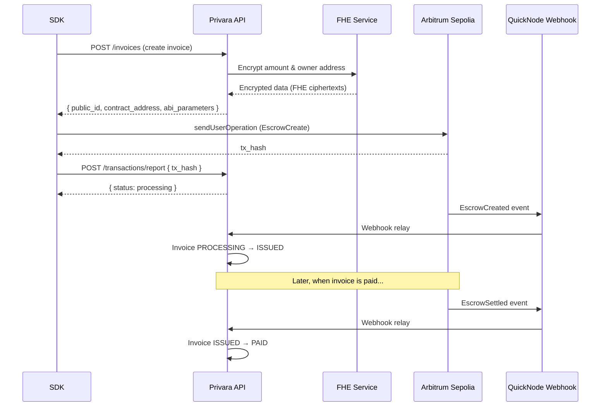
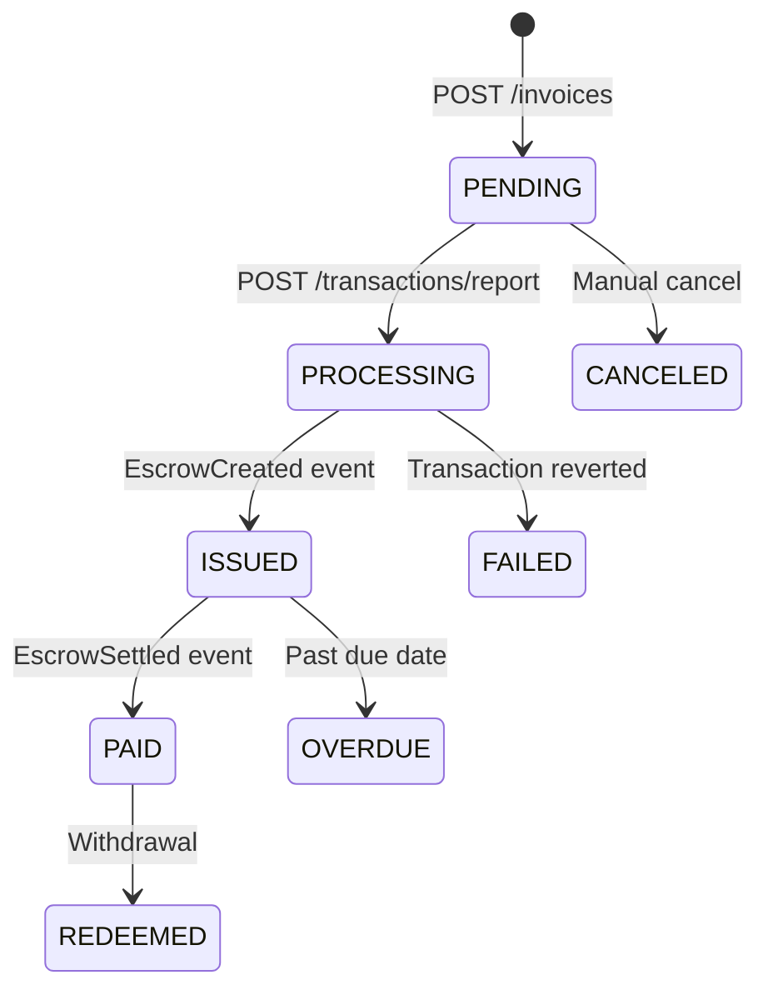
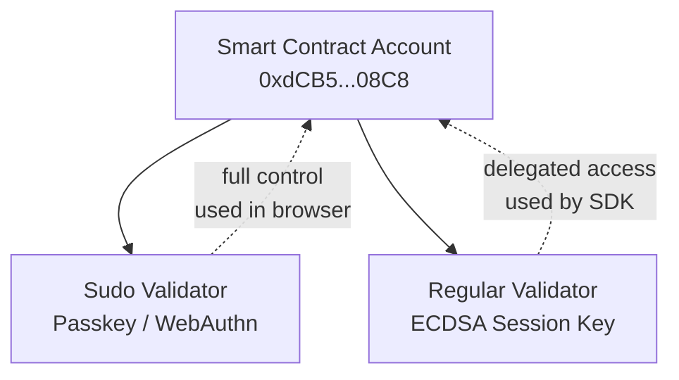
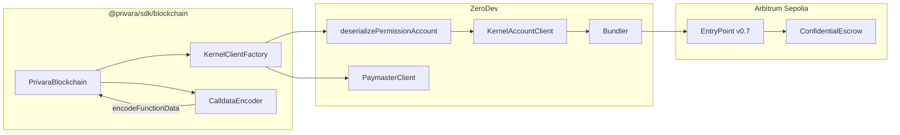

# Blockchain Module

`@privara/sdk/blockchain` handles on-chain invoice operations on Arbitrum Sepolia via [ZeroDev](https://zerodev.app/) account abstraction (ERC-4337).

## How it works



The SDK handles steps 1-3 (create, submit, report). Steps 4-5 happen automatically on the backend via QuickNode webhooks.

## Invoice status lifecycle



| Status | Triggered by | Description |
|--------|-------------|-------------|
| **PENDING** | `POST /invoices` | Invoice created, FHE-encrypted data ready for on-chain submission |
| **PROCESSING** | `POST /transactions/report` | UserOperation submitted, awaiting on-chain confirmation |
| **ISSUED** | `EscrowCreated` event | Escrow created on-chain, invoice is live and payable |
| **PAID** | `EscrowSettled` event | Payment received, escrow settled |
| **REDEEMED** | Withdrawal flow | Funds withdrawn by invoice creator |

## Prerequisites

### 1. Install peer dependencies

```bash
pnpm add viem @zerodev/sdk @zerodev/permissions
```

These are optional peer dependencies of `@privara/sdk` and only needed when importing from `@privara/sdk/blockchain`.

### 2. API credentials

Create OAuth M2M credentials in the Privara web app: **Profile > API Credentials**.

This produces a `client_id` (`pvr_...`) and `client_secret` (`pvrs_...`).

### 3. Session key

Generate a session key in the Privara web app: **Profile > Create session key**.

This produces a Base64-encoded string that you pass to the SDK.

#### What is a session key?

Privara uses ZeroDev's [Kernel](https://docs.zerodev.app/sdk/core-api/create-account) smart contract accounts (SCA) for on-chain operations. Each SCA has two validator slots:



- **Sudo validator** (passkey) — the primary key, created when you register your wallet. Requires biometric confirmation in the browser.
- **Regular validator** (session key) — a delegated ECDSA key that can sign transactions on behalf of the same SCA without requiring passkey interaction. This is what the SDK uses.

The serialized session key contains:
- The SCA account address (so the SDK sends transactions from the correct account)
- The ECDSA private key (for signing UserOperations)
- Permission policies (what the key is allowed to do)
- The plugin enable signature (passkey approval that authorized this session key)

#### Security considerations

- The session key has the same permissions as the passkey (sudo policy). Treat it as a secret.
- Store it securely. Do not commit it to source control.
- If compromised, revoke the executor wallet in the Privara web app and create a new one.

## Usage

### Full flow (one call)

```ts
import {Privara} from '@privara/sdk';
import {PrivaraBlockchain} from '@privara/sdk/blockchain';

const privara = new Privara({
    clientId: 'pvr_...',
    clientSecret: 'pvrs_...',
    baseUrl: 'https://api.privara.xyz',
});

const blockchain = new PrivaraBlockchain(privara, {
    serializedSessionKey: process.env.PRIVARA_SERIALIZED_SESSION_KEY,
});

const result = await blockchain.invoices.createAndSubmit({
    from: 'alice@example.com',
    due_date: '2025-12-31',
    reference: 'Order #1234',
    amount: 100,
    currency: {type: 'crypto', code: 'USDC'},
});

console.log(result);
// {
//   public_id: '550e8400-...',
//   tx_hash: '0xabc...',
//   status: 'processing'
// }
```

`createAndSubmit` performs three operations:
1. `privara.invoices.create()` — creates the invoice via API, triggers FHE encryption
2. `blockchain.sendInvoiceTransaction()` — encodes ABI calldata and submits a UserOperation
3. `privara.transactions.report()` — reports the tx hash to the backend

### Step-by-step

For more control, call each step individually:

```ts
// 1. Create invoice — returns contract address and ABI-encoded parameters
const invoice = await privara.invoices.create({
    from: 'alice@example.com',
    due_date: '2025-12-31',
    reference: 'Order #1234',
    amount: 100,
    currency: {type: 'crypto', code: 'USDC'},
});

// 2. Submit on-chain — encodes calldata, sends UserOperation via ZeroDev bundler
const txHash = await blockchain.sendInvoiceTransaction(invoice);

// 3. Report — links the on-chain transaction to the invoice in the backend
await privara.transactions.report({
    tx_hash: txHash,
    entity_type: 'invoice',
    entity_id: invoice.public_id,
});
```

### Lazy initialization

The ZeroDev kernel client is initialized lazily on the first `sendInvoiceTransaction` call and cached for subsequent calls. This means the first call may take a few seconds longer while the client is being set up (deserializing the permission account, connecting to the bundler).

## Configuration

| Option | Type | Default | Description |
|---|---|---|---|
| `serializedSessionKey` | `string` | — | Base64-encoded session key from the Privara web app (required) |
| `zerodevProjectId` | `string` | `94a91379-...` | ZeroDev project ID |
| `zerodevBundlerUrl` | `string` | Derived from project ID | Custom bundler/paymaster RPC URL |
| `rpcUrl` | `string` | `https://sepolia-rollup.arbitrum.io/rpc` | Arbitrum Sepolia JSON-RPC endpoint |
| `chain` | `string` | `arbitrum-sepolia` | Target chain |

### Bundler URL

If not provided, the bundler URL is derived from the project ID:

```
https://rpc.zerodev.app/api/v3/{projectId}/chain/421614
```

This URL is used for both the bundler (submitting UserOperations) and the paymaster (gas sponsorship).

## Architecture



### Key components

- **PrivaraBlockchain** — main class, orchestrates the flow and exposes `invoices.createAndSubmit()`
- **KernelClientFactory** — deserializes the session key into a ZeroDev kernel account client
- **CalldataEncoder** — encodes the ABI function call from the invoice response parameters using `viem.encodeFunctionData`

### On-chain contract

The `ConfidentialEscrow.create()` function accepts FHE-encrypted parameters:

```solidity
function create(
    InEaddress calldata encryptedOwner,  // FHE-encrypted owner address
    InEuint64 calldata encryptedAmount,  // FHE-encrypted payment amount
    address resolver                      // Address that can settle the escrow
) external returns (uint256 escrowId)
```

Each `InEaddress` / `InEuint64` is a tuple: `(uint256 ctHash, uint8 securityZone, uint8 utype, bytes signature)`.

The FHE encryption is performed server-side by the Privara API. The SDK receives the pre-encrypted parameters and only needs to submit them on-chain.

## Troubleshooting

### `InvalidSigner` error

The on-chain transaction is being sent from a different SCA address than the one the FHE data was encrypted for. This happens when the session key doesn't match the user's wallet. Make sure you're using the session key generated for the correct account.

### `ChainId not found`

The bundler URL format is incorrect. Ensure it follows the pattern:
```
https://rpc.zerodev.app/api/v3/{projectId}/chain/421614
```

### Transaction stuck in PROCESSING

The backend relies on QuickNode webhooks to detect on-chain events. If the webhook is not configured or the transaction hasn't been mined, the status will remain `PROCESSING`. Check the transaction hash on [Arbiscan Sepolia](https://sepolia.arbiscan.io/).
